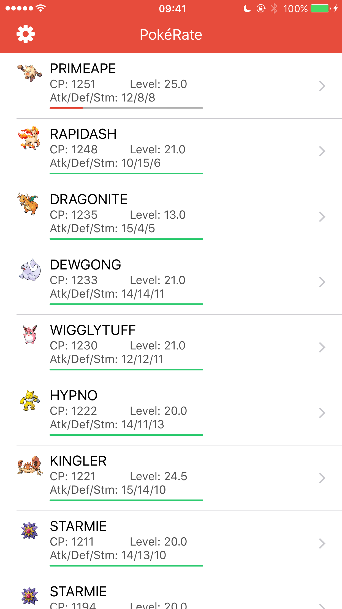

# PokéRate

Using the initial implementation of the Pokémon GO API on Swift by [Luke Sapan](https://github.com/lsapan/pgoapi-swift), this app aims to do the perfect calculations for your Pokémon.

### Screenshots

### To Do

- [x] Pokémon Trainer Club login
- [ ] Google login
- [x] Show Pokémon
- [ ] Display Pokémon full details
- [ ] Calculate %
